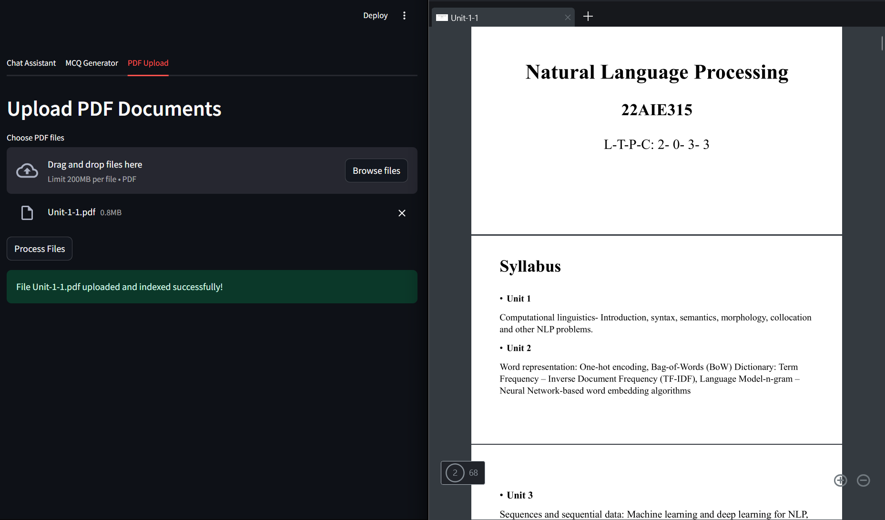
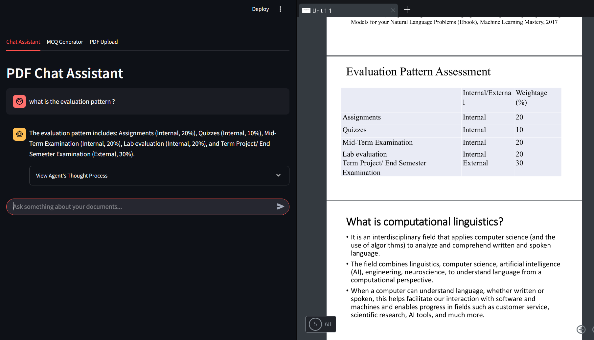

# DocuGenie: RAG-Powered PDF Assistant & MCQ Generator

DocuGenie is a Streamlit-based application that transforms your static PDF documents into an interactive AI-powered assistant. Built with retrieval-augmented generation (RAG) and LangChain agents, it allows users to chat with their documents, generate topic-specific MCQs, and receive contextual feedback—all in one intuitive interface.

---

## 🔍 Features

- 🧠 **Conversational PDF Chatbot**  
  Ask questions about uploaded PDFs with context-aware answers using Gemini .

- 📄 **Document Summarization & Keyword Extraction**  
  Quickly extract key insights and summaries for study or review.

- ❓ **AI-Powered MCQ Generator**  
  Generate MCQs of variable difficulty from document content and test your knowledge.

- 🧾 **Immediate Feedback**  
  Detailed explanations for wrong answers help reinforce learning.

---

## 📸 Screenshots

### 📂 Upload & Process Documents


---

### 💬 Chat with Your PDFs


---

### 🧠 Auto-Generate MCQs & Take Quizzes


---

## 🚀 Installation

### 1. Clone the Repository

```bash
git clone https://github.com/Advaith35/DocuGenie.git
cd DocuGenie
cd Backend
```

### 2. Install Dependencies

```bash
pip install -r requirements.txt
```

Or, for Anaconda users:

```bash
conda create -n DocuGenie python=3.10
conda activate DocuGenie
pip install -r requirements.txt
```

### 3. Add Your API Key

Create a `.env` file in the root directory:

```
GEMINI_API_KEY=your_google_gemini_api_key
```

---

## ▶️ Run the App

```bash
streamlit run app.py
```

Visit `http://localhost:8501` in your browser.

---

## 📁 Folder Structure

```
DocuGenie/
├── app.py
├── func.py
├── requirements.txt
├── .env
├── uploads/               # Where PDFs are uploaded
├── faiss_index.index      # FAISS index file (generated)
├── in_memory_docstore.pkl # Serialized DocStore
├── index_to_docstore_id.pkl
└── screenshots/
    ├── processing.png
    ├── demo.png
    └── mcq_generator.png
```

---

## ⚙️ Tech Stack

- **Streamlit** – UI Framework  
- **Google Gemini Pro** – LLM backend via LangChain  
- **LangChain Agents** – Tool orchestration and memory  
- **FAISS** – Vector similarity search  
- **PyMuPDF (fitz)** – PDF parsing  
- **DuckDuckGo Search API** – Web fallback  
- **NumPy, Pickle** – Storage & computation

---

## 📚 Use Cases

- Study assistant for dense academic PDFs  
- MCQ generation for test prep  
- Document QA for research reports, whitepapers  
- Feedback and reinforcement tool for students

---

## 🧠 Credits

Developed by [Your Name]  
Powered by LangChain, Gemini, and Streamlit
